# Gestor de Vuelos - Django REST Framework

## Descripción
API REST desarrollada con Django y Django REST Framework para administrar vuelos y aerolíneas. Permite realizar operaciones CRUD completas sobre ambas entidades, con relación entre vuelos y aerolíneas.

## Tecnologías usadas
- Python
- Django
- Django REST Framework
- SQLite
- Postman / Thunder Client
- Git y GitHub

## Instalación y ejecución

Clonar el repositorio:
```bash
git clone https://github.com/Laboratorios-Tecsup/EXAMEN-08.git
cd EXAMEN-08
```

Crear entorno virtual:
```bash
python -m venv venv
venv\Scripts\activate
```

Instalar dependencias:
```bash
pip install -r requirements.txt
```

Ejecutar migraciones:
```bash
python manage.py makemigrations
python manage.py migrate
```

Levantar servidor:
```bash
python manage.py runserver
```

URL base: http://127.0.0.1:8000/api/

## Endpoints disponibles

### Aerolíneas
| Método | Endpoint | Descripción |
|--------|----------|-------------|
| GET | /api/airlines/ | Lista todas las aerolíneas |
| POST | /api/airlines/ | Crea una aerolínea |
| PUT | /api/airlines/{id}/ | Actualiza una aerolínea |
| DELETE | /api/airlines/{id}/ | Elimina una aerolínea |

### Vuelos
| Método | Endpoint | Descripción |
|--------|----------|-------------|
| GET | /api/flights/ | Lista todos los vuelos |
| POST | /api/flights/ | Crea un vuelo |
| PUT | /api/flights/{id}/ | Actualiza un vuelo |
| DELETE | /api/flights/{id}/ | Elimina un vuelo |
| GET | /api/flights/?search=LA101 | Busca por código |
| GET | /api/flights/?origin=Lima | Filtra por origen |

---

## 📌 EVIDENCIAS

## 📌 Crear Aerolínea (POST)
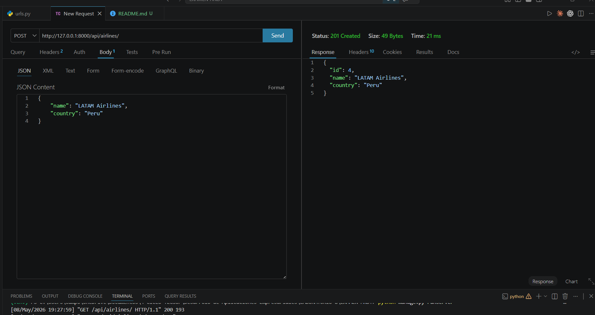

## 📌 Base de datos - Aerolínea creada
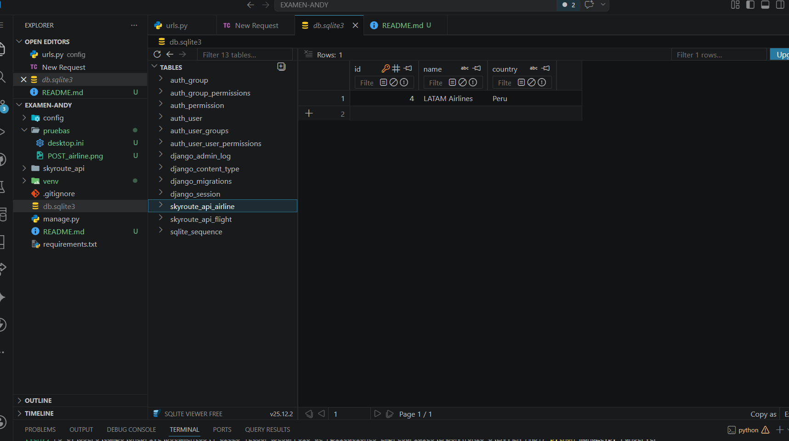

## 📌 Listar Aerolíneas (GET)
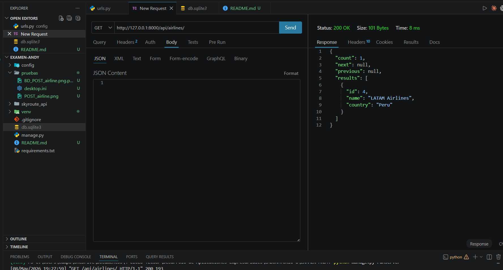

## 📌 Actualizar Aerolínea (PUT)
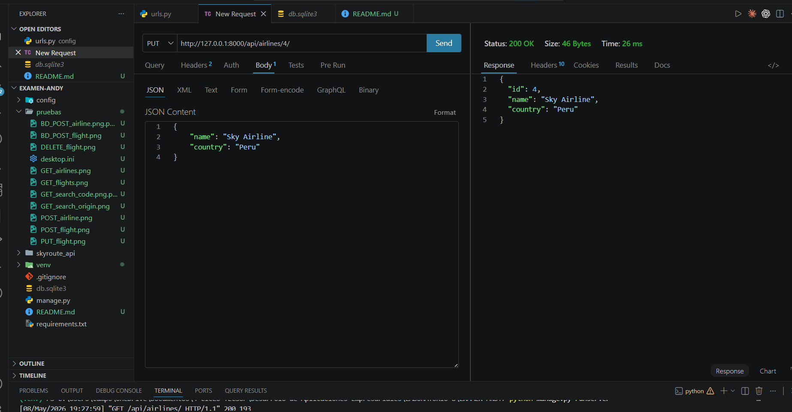

## 📌 Eliminar Aerolínea (DELETE)
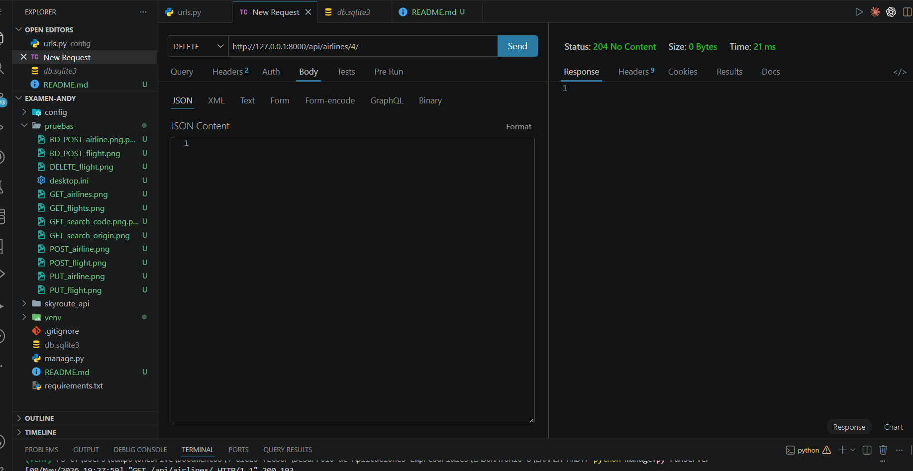

## 📌 Crear Vuelo (POST)
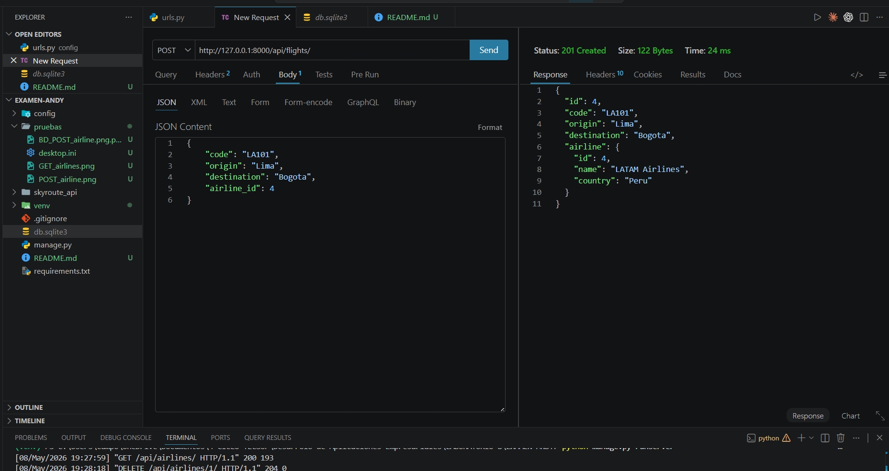

## 📌 Base de datos - Vuelo creado
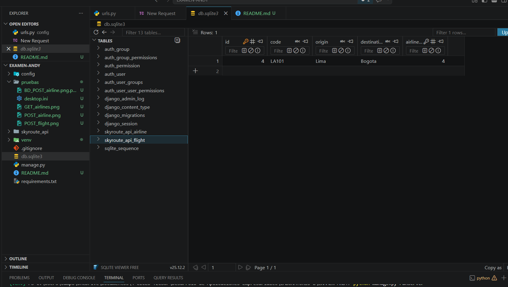

## 📌 Listar Vuelos (GET)
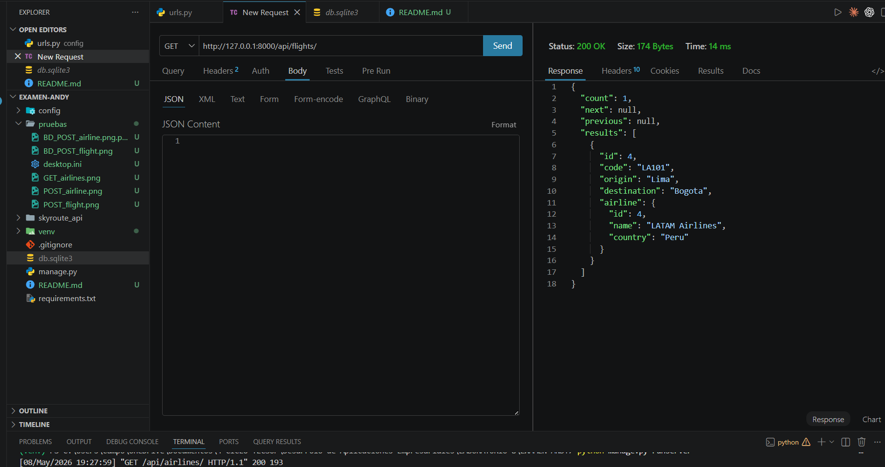

## 📌 Búsqueda por origen
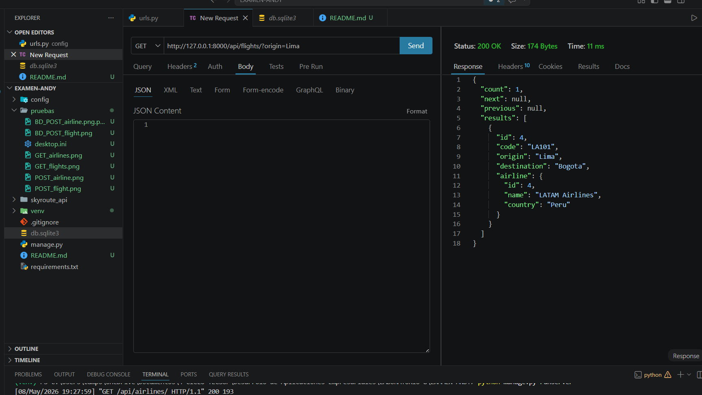

## 📌 Búsqueda por código
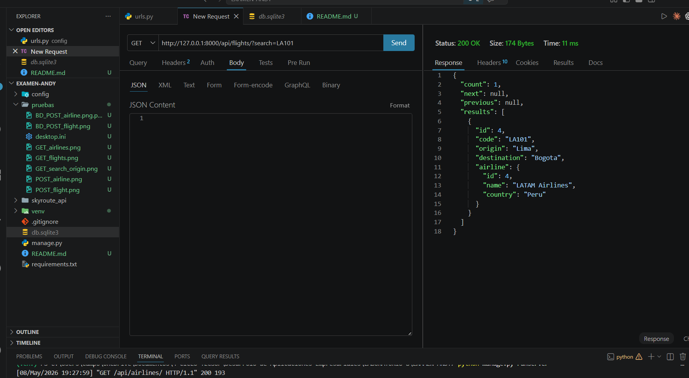

## 📌 Actualizar Vuelo (PUT)
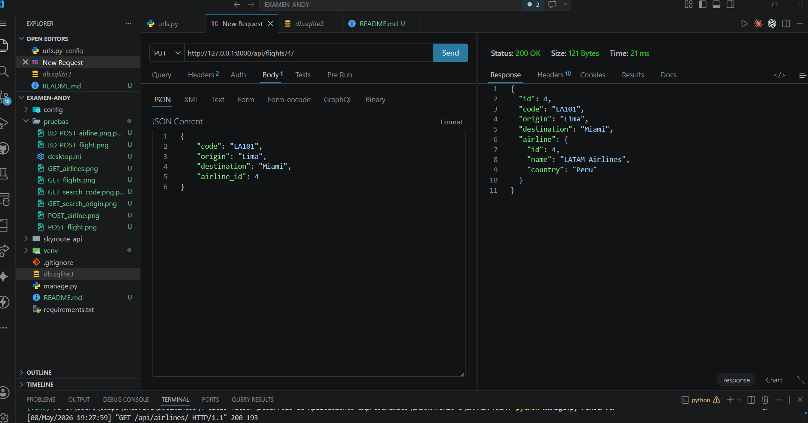

## 📌 Eliminar Vuelo (DELETE)
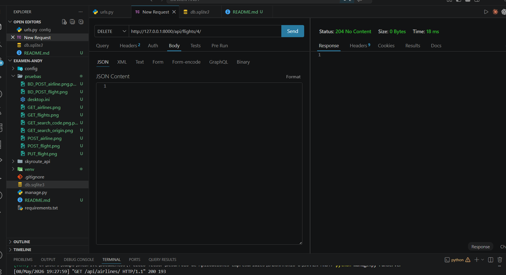